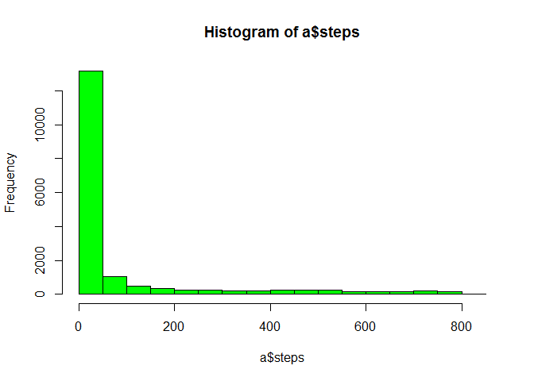
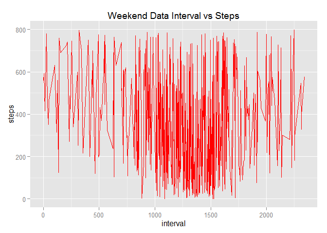
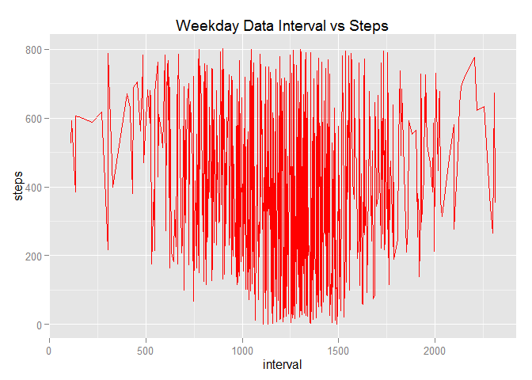

##  Reproducible Research Project #1
This assignment maks use of data frm a personnnel activity monitoring device 
This device collects data at 5 minute intervals through out the day 
Data collected during the months of Octber and November, 2012. 

```r
setwd("/Users/sstone25/datasciencecoursera/Reproducible_Research")
```

* download and store the file in the Working directory

```r
url <- "http://d396qusza40orc.cloudfront.net/repdata%2Fdata%2Factivity.zip"
download.file(url, destfile="activity.zip")
```
* unzip file

```r
unzip("activity.zip")
```

* read.csv with colClasses & convert date column from Factor to Character

```r
df <-read.csv("activity.csv",  header = TRUE, sep = ",")
View(df)
```

###  What is mean total number of steps taken per day?
*  Calculate the total number of steps taken per day

```r
TotalSteps <- aggregate(df$steps, list(Date = df$date), FUN = "sum")
a <- sum(TotalSteps$steps)
```
*  Calculate and report the mean of the total number of steps taken per day

```r
stepsMean <- mean(TotalSteps$x, na.rm=TRUE)
print(stepsMean)
```

```
## [1] 10766.19
```
*  The mean of the total number of steps taken per day is 10766.19

###  Make a histogram of the total number of steps taken each day

```r
hist(TotalSteps$x, col = "blue") 
```

 
*                                 Calculate and report the median of the total number of steps taken per day

```r
stepsMedian <- median(TotalSteps$x, na.rm=TRUE)
stepsMedian
```

```
## [1] 10765
```
*The median of the total number of steps taken per day is 10765
#
### What is the average daily activity pattern?  
* Make a time series plot (i.e. type = "l")ofthe 5-minute interval (x-axis) and the average number of steps taken, averaged across all days (y-axis)

```r
Interval_Ave_Steps <- aggregate(steps ~ interval, data = df, FUN = mean)
View(Interval_Ave_Steps)

library(ggplot2)
ggplot(Interval_Ave_Steps, aes(x = interval, y = steps)) + geom_line(color = "red") + labs(title = "Interval vs Steps")
```

 
*  Which 5-minute interval, on average across all the days in the datasets contains the maximum number of steps?

```r
library(dplyr)
```

```
## 
## Attaching package: 'dplyr'
## 
## The following object is masked from 'package:stats':
## 
##     filter
## 
## The following objects are masked from 'package:base':
## 
##     intersect, setdiff, setequal, union
```

```r
max_steps <- arrange(df, desc(steps))
head(max_steps, n = 1L)
```

```
##   steps       date interval
## 1   806 2012-11-27      615
```
*  Interval 615 has the maximum number of steps, whis is 806
#
#
### Imputing missing values
* Note that there are a number of days/intervals where there are missing values (coded as NA). 
* The presence of missing days may introduce bias into calculations or summaries of the data.
#
*  Calculate and report the total number of missing values in the dataset (i.e. 
the total number of rows with NAs
*  Count number of NA's

```r
na_dat <- sum(is.na(df))
head(na_dat, n = 1L)
```

```
## [1] 2304
```
*  There are 2304 number of missing values in the dataset
#
###  Devise a strategy for filling in all of the missing values in the dataset.  
*Create a new dataset that is equal to the original dataset but with the missing data filled in.

```r
a <- df 
for (i in 1:nrow(a)) {
    if (is.na(df$steps[i])) {
        a$steps[i] <- sample(1:800, 1, replace=T)
    }
}
View(a)
```
*The strategy is to replace the NA's with a random number between 1 and 400
#
### Make a histogram of the total number of steps taken each day. 

```r
hist(a$steps, col = "green") 
```

 
* Calculate and report the mean total number of steps taken per day. 

```r
stepsMeanNew <- mean(a$steps, na.rm=TRUE)
stepsMeanNew
```

```
## [1] 85.16211
```
*  The mean total number of steps taken per day is 84.40631
#
### Do these values differ from the estimates from first part of the assignment?
#
* calculate mean

```r
stepsMean <- mean(TotalSteps$x, na.rm=TRUE)
stepsMean
```

```
## [1] 10766.19
```
* the mean of the total number of steps for the first part is 10766.19
*  calculate mean

```r
stepsMeanNew <- mean(a$steps, na.rm=TRUE)
stepsMeanNew
```

```
## [1] 85.16211
```
*the mean of the total number of steps for the second part is 84.40631

### Yes, the means differ from the first to the second part of the assignment? 
#
* What is the impact of imputing missing data on estimates of total daily number of steps?
* The part #1 Histogram is looks like Normal distribution and the part #2 Histogram lokks skewed to the left. 
#
###  Are there differences in activity patterns between weekdays and weekends?
*Use the dataset with the filled-in missing values for this part.
*Create a new factor variable in the dataset with two levels - "weekday" and "weekend" indicating whether a given date is a weekday or weekend day.

```r
library(lubridate)
tempDate <- a$date
View(tempDate)
#
newDate <- wday(tempDate, label = T)
View(newDate)
#
a[,"newDate"] <- newDate
View(a)
#
variableWeekend <- filter(a, newDate == "Sat" | newDate == "Sun") 
View(variableWeekend)

variableWeekdays <- filter(a, newDate == "Mon" | newDate == "Tue" | newDate == "Wed" | newDate == "Thurs" | newDate == "Fri") 
View(variableWeekdays)
```
#
###  Make a panel plot containing a time series plot (i.e. type = "l") of the 5-minute interval #  (x-axis) and the average number of steps taken, averaged across all weekday days or weekend  days (y-axis). 

```r
plotData <- aggregate(interval ~  steps, data = variableWeekend, FUN = mean)

plotData1 <- aggregate(interval ~  steps, data = variableWeekdays, FUN = mean)
```
#

```r
library(ggplot2)
ggplot(plotData, aes(x = interval, y = steps)) + geom_line(color = "red") + labs(title = "Weekend Data Interval vs Steps")
```

 

```r
ggplot(plotData1, aes(x = interval, y = steps)) + geom_line(color = "red") + labs(title = "Weekday Data Interval vs Steps")
```

 
